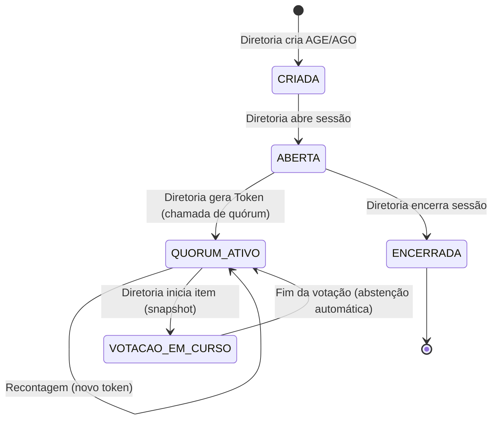

# Guia de Uso: Módulo de Assembleias (Mobile)

Este guia descreve o fluxo operacional do módulo de Assembleias no aplicativo móvel, distinguindo as ações por perfil (Diretoria vs. Filiado).

## 1. Fluxo da Diretoria (Gestão)

A Diretoria é responsável por conduzir a sessão, desde a criação até o encerramento.

### Passo 1: Criar Assembleia
1. Acesse o menu **Votação**.
2. Clique no botão flutuante **(+)**.
3. Preencha o Título, Tipo (AGE/AGO) e a Pauta.
4. A assembleia será criada com o status `CRIADA`.

### Passo 2: Abrir a Sessão
1. Na lista de assembleias, selecione a assembleia desejada.
2. Clique em **Abrir Assembleia**. O status mudará para `ABERTA`.

### Passo 3: Chamada de Quórum
1. Dentro dos detalhes da assembleia aberta, clique em **Gerar Novo Token de Quórum**.
2. Um código de 6 dígitos será exibido. Comunique este código aos presentes para que realizem o check-in.

### Passo 4: Iniciar Votações
1. Após o check-in dos presentes, clique em **Iniciar Nova Votação**.
2. Informe o título do item, descrição e a duração (1 a 5 minutos).
3. Ao clicar em **Iniciar**, um snapshot de elegibilidade é criado: apenas quem realizou o check-in *antes* deste momento poderá votar.

### Passo 5: Acompanhamento e Encerramento
1. Na **Sala de Votação**, acompanhe os votos nominais em tempo real e o cronômetro.
2. Após concluir todos os itens, retorne aos detalhes e clique em **Encerrar Assembleia**.

---

## 2. Fluxo do Filiado (Participação)

O Filiado participa da assembleia realizando check-in e votando nos itens de pauta.

### Passo 1: Check-in
1. Acesse o menu **Votação** e selecione a assembleia com status `ABERTA`.
2. Informe o **Token de 6 dígitos** fornecido pela Diretoria.
3. Clique em **Confirmar Presença**.

### Passo 2: Sala de Votação
1. Após o check-in, clique em **Ir para a Sala de Votação**.
2. Se houver uma votação ativa e você for elegível, os botões **SIM** e **NÃO** estarão disponíveis.
3. Se você entrou na sala após o início de um item, aguarde o próximo para votar.

### Passo 3: Interação
1. Use o botão **Pedir Palavra** para entrar na fila de oradores.
2. Use o botão **Proposta** para enviar encaminhamentos por escrito.

---

## 3. Ciclo de Vida da Sessão

