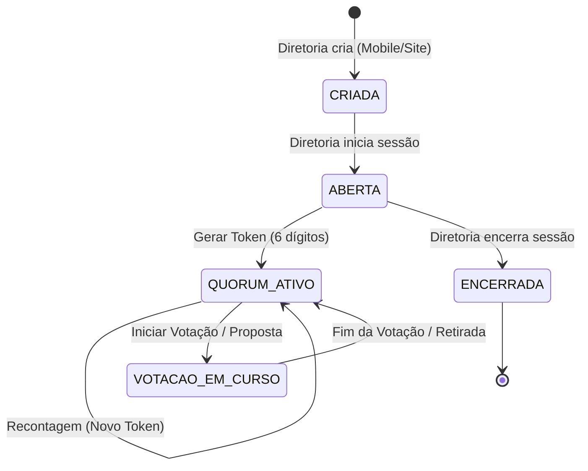

# Assembleias e Votações - CANON

Este documento define o padrão arquitetural, as regras de negócio e o schema de dados para o módulo de Assembleias e Votações. Ele é a fonte única de verdade para implementação no Backend, Mobile e Site.

## 1. Princípios Fundamentais

### 1.1. Hierarquia de Verdade
1.  **Backend:** Fonte absoluta para regras de elegibilidade, auditoria e controle de tempo.
2.  **App Mobile (Prioridade UX):** Interface principal para interação em tempo real (votação, check-in, presença).
3.  **Site (Consulta):** Espelhamento de estado, relatórios de ata e exportações.

### 1.2. Premissas Críticas
- **Voto Aberto:** Todo voto é público e associado ao nome do filiado.
- **Transparência Total:** Contagem parcial em tempo real visível para todos os presentes.
- **Auditoria Imutável:** Todo evento gera um log persistente (`append-only`).
- **Elegibilidade Dinâmica:** O Backend congela a lista de votantes no momento exato da abertura de cada item de pauta, baseado no quórum vigente.
- **Abstenção:** Quem não vota dentro do prazo é registrado como ABSTENÇÃO, que soma ao total de SIM.

---

## 2. Fluxo Funcional Canônico

### 2.1. Gestão da Sessão
1.  **Criação:** Perfil DIRETORIA cria a assembleia (AGE/AGO). Estado inicial: `CRIADA`.
2.  **Abertura:** No momento do evento, a diretoria abre a sessão. Estado: `ABERTA`.
3.  **Check-in e Quórum:**
    - A diretoria gera um **Token de 6 dígitos** (validade curta).
    - Todos os presentes (inclusive diretores) realizam o check-in no app usando o token.
    - O sistema permite múltiplas "Chamadas de Quórum" durante a sessão. A última chamada válida define o conjunto de votantes elegíveis para os próximos itens.
4.  **Mesa Diretora:** A diretoria seleciona, entre os filiados que fizeram check-in, o Presidente e o Secretário da mesa.
5.  **Encerramento:** A diretoria encerra a sessão. O sistema gera automaticamente a Ata e consolida os logs. Estado: `ENCERRADA`.

### 2.2. Dinâmica de Votação
1.  **Abertura do Item:** A diretoria define título, descrição e duração (1 a 5 min).
2.  **Congelamento (Snapshot):** Ao abrir, o backend identifica todos os filiados presentes na última chamada de quórum. Apenas estes podem votar neste item.
3.  **Voto:** Opções SIM e NÃO.
4.  **Tempo Real:** O app exibe a contagem parcial e quem votou em quê à medida que os votos entram.
5.  **Fechamento:** Ao fim do tempo (ou interrupção manual), o backend processa as abstenções e finaliza o resultado.
6.  **Retirada:** A diretoria pode retirar um item antes/durante a votação, com justificativa obrigatória.

### 2.3. Uso da Palavra e Propostas
- **Fila de Palavra:** Filiados pedem a palavra via app; a diretoria gerencia a ordem.
- **Propostas (Encaminhamentos):** Qualquer presente pode cadastrar uma proposta.
- **Conversão em Votação:** Toda proposta deve ser submetida a voto (SIM/NÃO) ou retirada pelo autor.
- **Retirada Automática:** Se o autor de uma proposta não estiver presente na chamada de quórum vigente no momento da votação, a proposta é retirada automaticamente por ausência.

---

## 3. Diagrama de Estados (Sessão)

---

## 4. Schema de Dados (PostgreSQL)

### 4.1. Tabelas de Estrutura
#### `assembleias`
- `id`: `UUID PRIMARY KEY`
- `tipo`: `VARCHAR(10)` (AGE, AGO)
- `titulo`: `VARCHAR(255)`
- `descricao`: `TEXT`
- `estado`: `ENUM` (CRIADA, ABERTA, ENCERRADA)
- `criado_por`: `UUID` (FK filiados)
- `aberta_em`: `TIMESTAMP`
- `encerrada_em`: `TIMESTAMP`

#### `assembleia_quoruns`
- `id`: `UUID PRIMARY KEY`
- `assembleia_id`: `UUID` (FK)
- `token`: `VARCHAR(6)`
- `valido_ate`: `TIMESTAMP`
- `criado_em`: `TIMESTAMP DEFAULT NOW()`

#### `assembleia_checkins`
- `id`: `UUID PRIMARY KEY`
- `quorum_id`: `UUID` (FK)
- `filiado_id`: `UUID` (FK)
- `registrado_em`: `TIMESTAMP DEFAULT NOW()`
- *Unique constraint:* `(quorum_id, filiado_id)`

#### `assembleia_mesa`
- `id`: `UUID PRIMARY KEY`
- `assembleia_id`: `UUID` (FK)
- `filiado_id`: `UUID` (FK)
- `cargo`: `ENUM` (PRESIDENTE, SECRETARIO)
- *Unique constraint:* `(assembleia_id, cargo)`

### 4.2. Tabelas de Interação
#### `assembleia_votacoes`
- `id`: `UUID PRIMARY KEY`
- `assembleia_id`: `UUID` (FK)
- `quorum_snapshot_id`: `UUID` (FK assembleia_quoruns) -- Define elegibilidade
- `titulo`: `VARCHAR(255)`
- `descricao`: `TEXT`
- `estado`: `ENUM` (AGUARDANDO, EM_CURSO, CONCLUIDA, RETIRADA)
- `duracao_minutos`: `INTEGER`
- `justificativa_retirada`: `TEXT`
- `aberta_em`: `TIMESTAMP`
- `finalizada_em`: `TIMESTAMP`

#### `assembleia_votos`
- `id`: `UUID PRIMARY KEY`
- `votacao_id`: `UUID` (FK)
- `filiado_id`: `UUID` (FK)
- `voto`: `ENUM` (SIM, NAO, ABSTENCAO)
- `registrado_em`: `TIMESTAMP DEFAULT NOW()`

#### `assembleia_pedidos_palavra`
- `id`: `UUID PRIMARY KEY`
- `assembleia_id`: `UUID` (FK)
- `filiado_id`: `UUID` (FK)
- `estado`: `ENUM` (PENDENTE, EM_FALA, CONCLUIDO, CANCELADO)
- `ordem`: `INTEGER`
- `criado_em`: `TIMESTAMP`

#### `assembleia_propostas`
- `id`: `UUID PRIMARY KEY`
- `assembleia_id`: `UUID` (FK)
- `autor_id`: `UUID` (FK)
- `titulo`: `VARCHAR(255)`
- `descricao`: `TEXT`
- `estado`: `ENUM` (PENDENTE, VOTADA, RETIRADA)
- `motivo_retirada`: `TEXT`

### 4.3. Auditoria
#### `assembleia_auditoria`
- `id`: `UUID PRIMARY KEY`
- `assembleia_id`: `UUID` (FK)
- `filiado_id`: `UUID` (FK)
- `evento`: `VARCHAR(50)` (Ex: CHECKIN, VOTO, ORDEM_PALAVRA, RECONTAGEM)
- `payload`: `JSONB`
- `criado_em`: `TIMESTAMP DEFAULT NOW()`

---

## 5. Protocolo de Tempo Real (Socket.IO Events)

### Servidor -> Clientes (Broadcast)
- `session_state_changed`: Notifica mudança de estado da assembleia.
- `new_quorum_call`: Novo token gerado, solicita check-in.
- `voting_started`: Abre painel de votação com snapshot de elegibilidade.
- `vote_cast`: Atualiza contagem parcial e lista pública de votos.
- `voting_ended`: Trava votação e exibe resultado final.
- `word_queue_updated`: Atualiza fila de pedidos de palavra.
- `new_proposal`: Nova proposta submetida.

### Clientes -> Servidor
- `join_assembleia`: Entra na sala da sessão.
- `submit_checkin`: Envia token de 6 dígitos.
- `cast_vote`: Envia SIM/NAO.
- `request_word`: Entra na fila de fala.
- `submit_proposal`: Envia novo encaminhamento.

---

## 6. Checklist de Não-Regressão

- [ ] **Elegibilidade:** Validar que apenas quem fez check-in na *última* chamada de quórum pode votar.
- [ ] **Abstenção:** Garantir que o backend registre abstenções para todos os elegíveis que não votaram.
- [ ] **Segurança:** Impedir que o Site envie comandos de diretoria (apenas Mobile App deve ter esta UX).
- [ ] **Persistência:** Verificar se todos os eventos de auditoria estão sendo gravados antes do broadcast de socket.
- [ ] **Sincronia:** Testar comportamento em caso de queda de conexão durante votação (re-sincronização automática).

---

## 7. Exemplos Narrados

### Cenário A: Recontagem de Quórum
1. João faz check-in às 19:00 (Token A).
2. Às 19:30, a Diretoria solicita nova chamada (Token B).
3. João está no café e não vê o aviso. Não faz check-in no Token B.
4. Às 19:40, inicia-se uma votação. João **não pode votar**, pois não consta no quórum vigente (Token B).

### Cenário B: Proposta de Ausente
1. Maria cadastra proposta "Melhoria do Estacionamento".
2. Na hora de votar a proposta, Maria teve que sair da assembleia e não fez check-in na última chamada.
3. O sistema retira a proposta automaticamente com o log: "Proposta retirada por ausência do autor".

---
> “Qualquer implementação futura deve seguir este documento. Divergências são bugs.”
