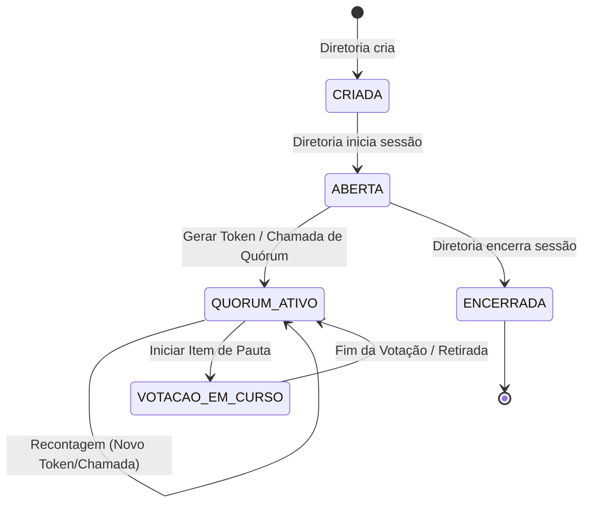

# Assembleias e Votações - CANON

Este documento define o padrão arquitetural, as regras de negócio e o schema de dados para o módulo de Assembleias e Votações. Ele é a fonte única de verdade para implementação no Backend, Mobile e Site.

## 1. Princípios Fundamentais

### 1.1. Hierarquia de Verdade
1.  **Backend (Regra Absoluta):** Fonte única para regras de elegibilidade, auditoria, persistência e controle de tempo.
2.  **App Mobile (Prioridade UX):** Interface primária e obrigatória para interação em tempo real (check-in, votação, pedidos de palavra).
3.  **Site (Consulta/Espelho):** Visualização de estado, acesso a relatórios de ata e exportações históricas. Nunca dita regras ou permite comandos de gestão/votação.

### 1.2. Premissas Críticas
- **Voto Aberto:** Todo voto é público, nominal (associado ao filiado) e visível em tempo real.
- **Transparência Total:** Contagem parcial e lista de votantes atualizadas via WebSocket para todos os presentes.
- **Auditoria Imutável:** Todo evento relevante gera um log `append-only` (quem, quando, o quê).
- **Elegibilidade por Snapshot:** O Backend congela a lista de votantes (snapshot) no momento exato da abertura de cada **item de pauta**, baseado estritamente no **quórum vigente** (última chamada concluída).
- **Abstenção:** O filiado elegível que não manifestar voto até o encerramento do cronômetro é registrado automaticamente como ABSTENÇÃO, que soma ao total de SIM para fins de aprovação.

---

## 2. Fluxo Funcional Canônico

### 2.1. Gestão da Sessão
1.  **Criação:** Perfil **diretoria** cria a assembleia (AGE/AGO). Estado inicial: `CRIADA`.
2.  **Abertura:** No momento do evento, a **diretoria** abre a sessão. Estado: `ABERTA`.
3.  **Check-in e Quórum Vigente:**
    - A **diretoria** gera um **Token de 6 dígitos** com validade curta.
    - O sistema registra este evento como uma "Chamada de Quórum" independente.
    - Todos os presentes devem realizar o check-in no App Mobile.
    - O **quórum vigente** é sempre o resultado da última chamada de quórum realizada com sucesso. Recontagens anulam a validade de presenças de chamadas anteriores para itens futuros.
4.  **Mesa Diretora:** A **diretoria** seleciona o Presidente e o Secretário da mesa entre os filiados presentes no quórum vigente.
5.  **Encerramento:** A **diretoria** encerra a sessão, disparando a consolidação final da ata e logs. Estado: `ENCERRADA`.

### 2.2. Itens de Pauta e Votação
1.  **Abertura de Item:** A **diretoria** inicia a votação de um item definindo título, descrição e duração (1 a 5 min).
2.  **Snapshot de Elegibilidade:** Ao abrir o item, o backend captura instantaneamente todos os filiados com check-in ativo na última chamada de quórum. Quem entrar na assembleia após este marco não vota neste item específico.
3.  **Registro de Voto:** Opções nominais SIM e NÃO.
4.  **Tempo Real:** Broadcast instantâneo de cada voto para atualização do painel de contagem parcial.
5.  **Conclusão:** Processamento automático de abstenções para elegíveis remanescentes ao fim do tempo.

### 2.3. Pedidos de Palavra e Propostas
- **Fila de Palavra:** Gerenciada pela **diretoria**, permite que qualquer presente solicite fala e visualize sua posição na fila.
- **Propostas (Encaminhamentos):** Qualquer presente pode submeter uma proposta durante a sessão.
- **Retirada por Ausência:** Se no momento da votação de uma **proposta**, o autor não constar no **quórum vigente** (snapshot), a proposta é retirada automaticamente pelo sistema com a justificativa: "Proposta retirada por ausência do autor".

---

## 3. Diagrama de Estados (Sessão)

---

## 4. Schema de Dados (PostgreSQL)

Refletindo a separação entre presença, elegibilidade e intenção.

### 4.1. Estrutura de Sessão
- `assembleias`: Cabeçalho da sessão (tipo, título, estado).
- `assembleia_quoruns`: Registros independentes de chamadas de quórum (tokens).
- `assembleia_checkins`: Vínculo filiado <-> chamada de quórum.
- `assembleia_mesa`: Composição da mesa diretora por sessão.

### 4.2. Estrutura de Interação
- `assembleia_votacoes`: Itens de pauta (vinculados a um `quorum_snapshot_id`).
- `assembleia_votos`: Votos nominais (SIM, NAO, ABSTENCAO).
- `assembleia_pedidos_palavra`: Controle da fila de fala.
- `assembleia_propostas`: Encaminhamentos sugeridos por presentes.

### 4.3. Auditoria
- `assembleia_auditoria`: Log imutável de todos os eventos (CHECKIN, VOTO, RECONTAGEM, etc).

---

## 5. Marco de Implementação

Este documento foi validado e teve sua base técnica inicial implementada nas **Fases 1 e 2** (schema + foundation backend + realtime via Socket.IO), sem impacto em fluxos existentes.
UI e UX funcionais (App Mobile) serão implementadas nas próximas fases, seguindo rigorosamente estas definições.

---
> “Qualquer implementação futura deve seguir este documento. Divergências são bugs.”
