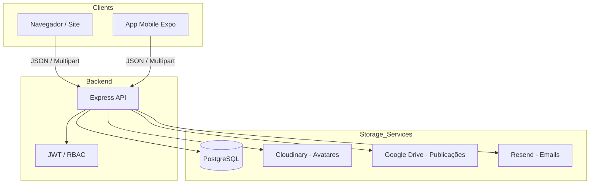

# Produção 2.0 - CANON Absoluto

## 1. Objetivo e Escopo

### 1.1. O que é "Produção 2.0"
Este documento define o estado "CANON" (fonte única de verdade) do repositório SINPRF-ES em sua versão 2.0. Ele serve como o marco zero para todas as futuras implementações, garantindo que a integridade arquitetural e as regras de negócio consolidadas não sofram regressão.

### 1.2. O que está incluído
- **Núcleo de Gestão de Filiados:** Cadastro, edição, arquivamento e auditoria.
- **Área do Filiado (Meus Dados):** Autenticação, atualização de perfil, dependentes e 2FA.
- **Módulos Satélites:** Publicações (Drive), Ressarcimento de Despesas e Jogos 2026.
- **Camada Shared:** Formatters e utilitários compartilhados entre Web e Mobile.

### 1.3. Fora de Escopo
- Novos módulos não homologados.
- Refatorações estruturais que alterem contratos de API sem migração documentada.
- Alterações em regras de negócio consolidadas (ex: compactação de dependentes).

## 2. Hierarquia de Verdade

A hierarquia de decisão em caso de divergência ou conflito técnico é absoluta:

1.  **Backend (src/):** A regra de persistência (Postgres), validação e contratos de API é a fonte final de verdade.
2.  **Site (public/):** Referência funcional e visual principal para o usuário final.
3.  **Mobile (mobile/):** Deve se adaptar ao comportamento do Backend e do Site. Nunca o contrário.

**Exemplo prático:** Se o Mobile espera um campo que o Backend não envia, o Mobile deve ser corrigido para lidar com a ausência ou o Backend deve ser estendido seguindo sua própria lógica interna, mas o Backend nunca deve ser "forçado" a emular um erro ou inconsistência do Mobile.

## 3. Mapa do Repositório (Inventário Profundo)

### 3.1. Backend (`src/`)
*   **`src/controllers/`**: Orquestração de requisições.
    *   `filiados.controller.js`: Gestão de perfil e administração de filiados.
    *   `publicacoes.controller.js`: Integração com Drive.
    *   `ressarcimento.controller.js`: Processamento de pedidos (PDF + Email).
    *   `jogos.controller.js`: Inscrições e cancelamentos dos Jogos 2026.
*   **`src/services/`**: Lógica de negócio e persistência.
    *   `filiados.service.js`: **CRÍTICO.** Contém lógica de compactação de dependentes (`dep1..dep5`), normalização de CPF e regras de arquivamento.
    *   `drive.service.js`: Abstração da API Google Drive.
    *   `email.service.js`: Envio via Resend (Filiados, Ressarcimento, Jogos).
    *   `pdf.service.js`: Geração de documentos (Fichas, Ressarcimento).
*   **`src/routes/`**: Definição de endpoints e middlewares de proteção.
*   **`src/middlewares/`**: `auth.js` (JWT) e `requirePermission.js` (RBAC).

### 3.2. Site (`public/`)
*   **`public/js/area-filiado/`**: Lógica frontend por módulo.
    *   `meus-dados.js`: Gerenciamento de perfil e dependentes (Web).
    *   `filiados-admin.js`: Painel de gestão (Admin).
    *   `jogos.js`: Formulário de inscrição Jogos 2026.
*   **`public/js/shared/`**:
    *   `format/formatters.js`: **CANON de máscaras Web.** Expõe `window.Formatters`.
*   **`public/css/style.css`**: Design system consolidado.

### 3.3. Mobile (`mobile/`)
*   **`mobile/src/shared/`**:
    *   `formatters.ts`: Implementação compatível com Metro (espelho da Web).
    *   `parentesco.ts`: Normalização de vínculos.
*   **`mobile/src/services/`**:
    *   `apiService.ts`: Centralizador de chamadas Axios com logging de debug.
    *   `filiadosService.ts`: Mapeamento de payloads para o Backend.

## 4. Mapa de Relações



### Fluxos Sensíveis:
1.  **Publicações:** Browser/Mobile -> `API /api/publicacoes` -> `Drive Service` -> Google Drive API.
2.  **Ressarcimento:** Browser -> `API /api/ressarcimentos` (FormData) -> `PDF Service` -> `Email Service` -> Resend.
3.  **Dependentes:** Browser/Mobile -> `API /me` (PUT) -> `Filiados Service` (Compactação) -> Postgres.

## 5. Contratos CANON (API + Dados)

### 5.1. Regras de Normalização (Cross-Platform)
*   **CPF:**
    *   **Banco:** String de 11 dígitos (apenas números).
    *   **Payload:** Deve ser enviado como string de 11 dígitos.
    *   **UI:** Máscara `000.000.000-00`.
*   **CEP:**
    *   **Banco:** String de 8 dígitos (apenas números).
    *   **UI:** Máscara `00000-000`.
*   **Telefone:**
    *   **Banco:** String normalizada (apenas dígitos).
    *   **UI:** Máscara `(DD) 9XXXX-XXXX` ou `(DD) XXXX-XXXX`.
*   **Datas:**
    *   **Banco:** Tipo `DATE` ou `TIMESTAMP`.
    *   **Payload (API):** Formato ISO `YYYY-MM-DD`.
    *   **UI:** Formato BR `DD/MM/YYYY`.

### 5.2. Valores Canônicos (Enums/Strings)
*   **Perfis de Acesso (`perfil_acesso`):** `ADMIN`, `DIRETORIA`, `FUNCIONARIO`, `COMUNICADOR`, `ORGANIZADOR` (FILIADO + Jogos Manager), `FILIADO`.
*   **Situação Funcional (`situacao`):** `ATIVO`, `APOSENTADO`, `PENSIONISTA`, `LICENCIADO`.
*   **Parentesco Dependentes (`parentesco`):** `FILHO_ENTEADO`, `CONJUGE_COMPANHEIRO`, `PAI_MAE`, `IRMAO`, `OUTRO`.

### 5.3. Payload Crítico: Meus Dados (PUT /api/filiados/me)
```json
{
  "nome": "String",
  "email1": "String (RFC 5322)",
  "telefone1": "String (Dígitos)",
  "cep": "String (8 dígitos)",
  "logradouro_bairro": "String",
  "numero": "String",
  "cidade": "String",
  "uf": "String (2 chars)",
  "dep1_nome": "String",
  "dep1_cpf": "String (11 dígitos)",
  "dep1_data_nascimento": "String (ISO)",
  "dep1_parentesco": "Enum"
}
```
*A compactação de dependentes é realizada pelo Backend; o Frontend deve enviar os slots `dep1` a `dep5` conforme preenchidos na UI.*

## 6. Shared Formatters (Padrão Obrigatório)

Para evitar divergências de UI, utilize exclusivamente as funções centralizadas:

### 6.1. Web (`public/js/shared/format/formatters.js`)
*   Namespace: `window.Formatters`
*   Principais: `onlyDigits`, `formatCpf`, `formatTelefone`, `formatCep`, `formatISOToBR`, `parseBRToISO`, `formatAgencia`, `formatConta`.
*   **Proibição:** Nunca use `export` neste arquivo (gera SyntaxError no navegador).

### 6.2. Mobile (`mobile/src/shared/formatters.ts` e `mobile/src/utils/date.ts`)
*   Implementações: `onlyDigits`, `formatCpf`, `formatTelefone`, `formatCep`, `toISODate`, `toBrazilianDate`.
*   **Proibição:** Não importe arquivos fora da pasta `mobile/` via caminhos relativos (quebra o Metro Bundler). Use cópias locais em `mobile/src/shared/`.

## 7. Não-Regressão: Checklist e Guardrails

Todo PR ou alteração deve validar:

### 7.1. Checklist de Verificação
- [ ] Não introduziu `export`/`import` em scripts da pasta `public/js/` (compatibilidade legada).
- [ ] Scripts no site usam guardas de inicialização (ex: `if (window.__MEUS_DADOS_INIT__) return;`).
- [ ] O contrato de resposta da API não foi alterado para campos existentes.
- [ ] Em alterações de dependentes, a compactação de slots (dep1..dep5) foi mantida.
- [ ] Mobile: As variáveis de ambiente usam o prefixo `EXPO_PUBLIC_`.

### 7.2. Smoke Tests Obrigatórios
1.  **Login:** Acesso com perfil `ADMIN` e `FILIADO`.
2.  **Meus Dados:** Alterar um telefone e salvar. Verificar se o valor persiste no recarregamento.
3.  **Gestão de Filiados:** Buscar um filiado por CPF (somente dígitos) e por Nome (substring case-insensitive).
4.  **Arquivamento:** Arquivar um filiado, verificar o badge de status e depois desarquivar.
5.  **Publicações:** Navegar em uma pasta e abrir um PDF via visualizador nativo (Web) ou WebView (Mobile).

## 8. Estado Atual = CANON (O que NÃO mexer)

Os seguintes componentes estão estáveis e não devem ser modificados sem aprovação excepcional:
- **Lógica de Auditoria:** Gravação em `filiados_eventos` dentro de blocos try/catch.
- **Compensação de Idade:** Regra dos Jogos 2026 (`2026 - ano_nascimento`).
- **Layout de Cards:** Padrão de cores e centralização de títulos (`.res-header`, `.res-card h3`).
- **CEP Lookup:** Preenchimento automático de campos de endereço (logradouro, bairro, cidade, UF).

## 9. Roadmap Controlado

- **Módulo Notícias Internas (CMS):** Perfil `COMUNICADOR` com princípio de *least privilege*. Ausência de acesso a dados de terceiros. Conteúdo consumido via API pelo site público, sem edição de HTML por usuários não técnicos.
- **Melhoria PDF Mobile:** Transição para visualizador de PDF 100% nativo (atualmente via WebView + Base64).
- **Notificações:** Expansão do sistema de Push para eventos específicos.

## 10. Protocolo de Manutenção e Evolução

### 10.1. Como comparar vs CANON
Para verificar se o estado atual do código divergiu do padrão Produção 2.0, utilize:
```bash
git diff prod-2.0 -- .
```

### 10.2. Política de Hotfix e Versionamento
1.  **Criação de Hotfix:** Todo hotfix deve partir da branch `release/producao-2.0` ou diretamente da tag `prod-2.0`.
2.  **Novas Tags:** Após a correção e validação, deve-se gerar uma nova tag incremental (ex: `prod-2.0.1`, `prod-2.0.2`).
3.  **Atualização do CANON:** Se a correção alterar um contrato ou comportamento descrito aqui, este documento deve ser atualizado na mesma tarefa.

---
**Status do Repositório:** CONGELADO (Produção 2.0)
**Referência Canônica (Tag):** `prod-2.0`
**Branch de Corte:** `release/producao-2.0`
**Data do Corte:** 20/01/2026 (Data atual do congelamento)

**Comandos para obter o SHA exato:**
```bash
git rev-parse prod-2.0
git show -s --format=%H prod-2.0
```
